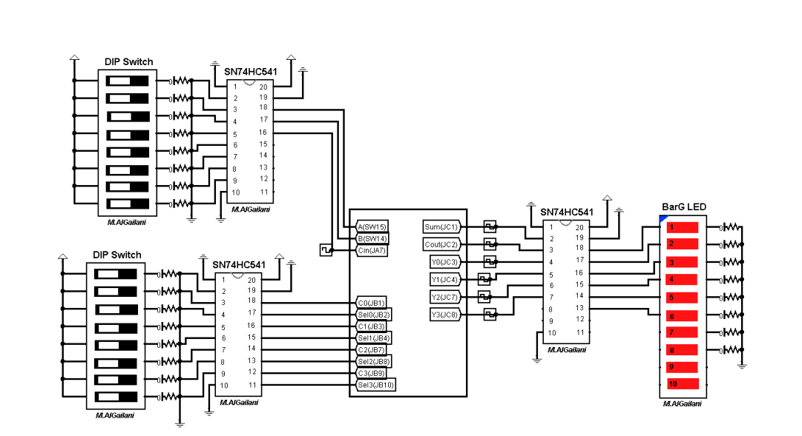
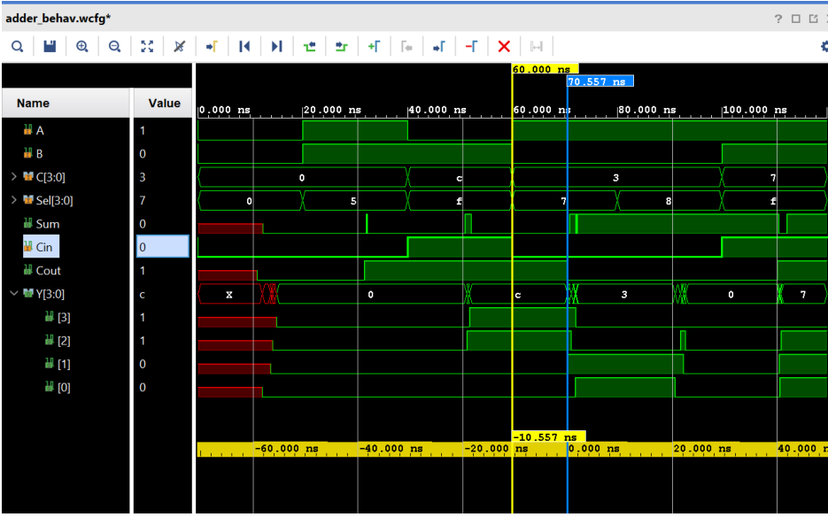
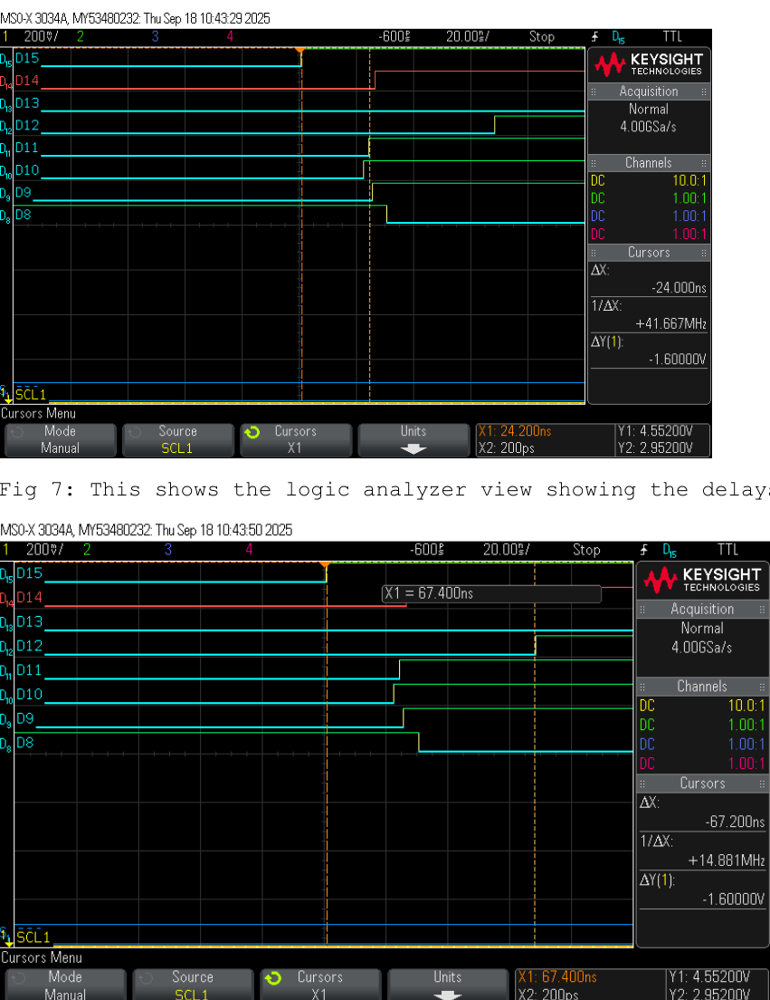
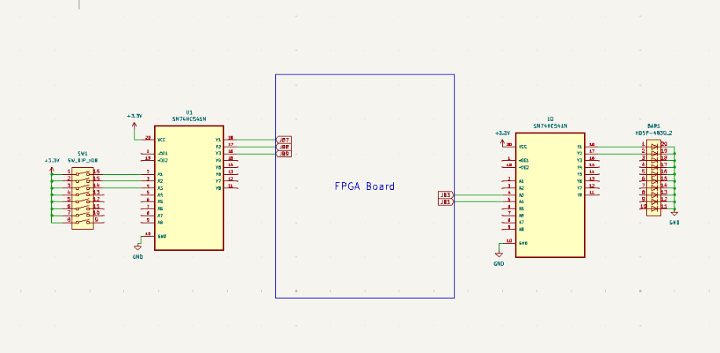
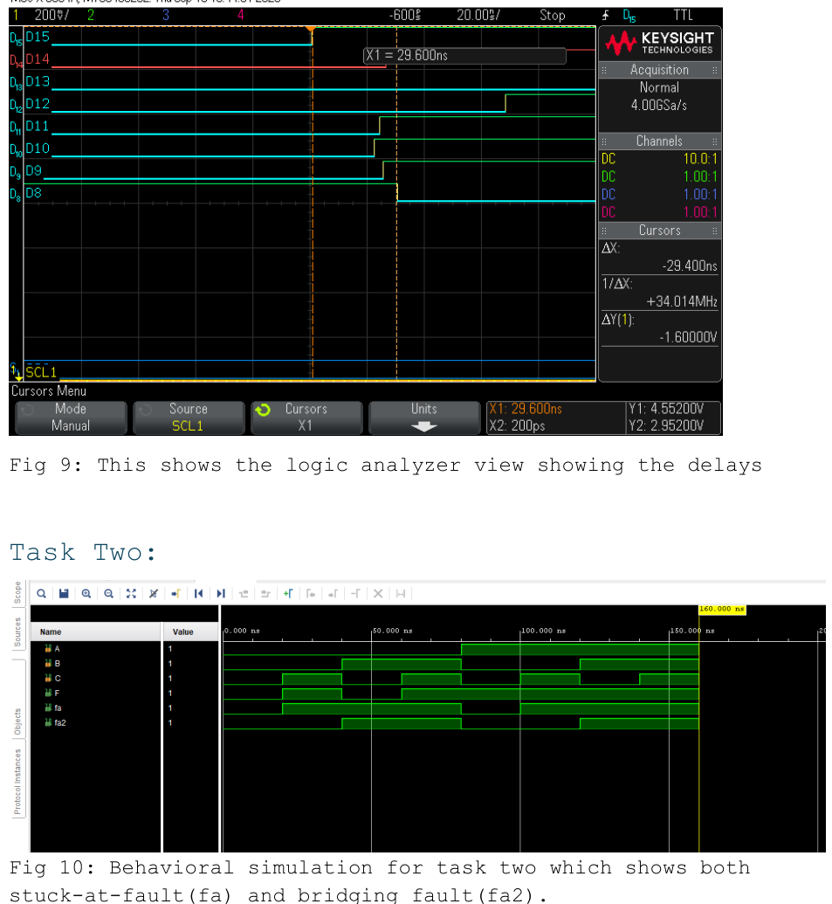
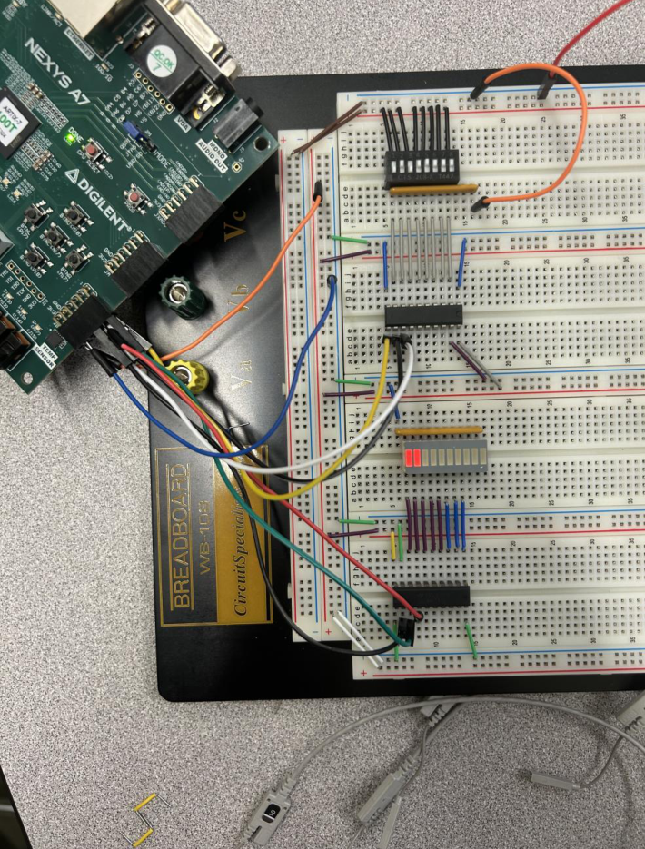
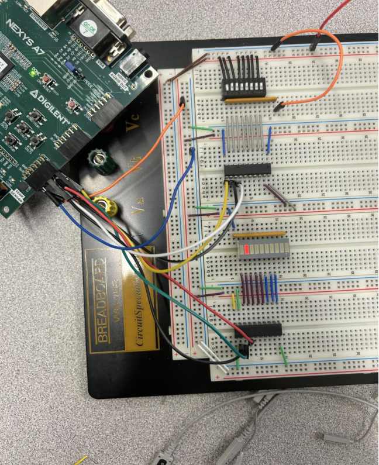

#  Timing Delays + Fault Modeling (VHDL + Nexys A7)

This lab is basically two things:
1) **Make timing delays show up on purpose** (so you can measure them), and  
2) **Treat “wrong circuits” like real designs** by modeling faults and proving your test vectors actually catch them.

Everything here comes straight from the Lab 3 report (ECE 4525 — 9/17/25, Mack Usmanova + Jena Francis).

---

## What you’ll find in this repo

- **Task 1:** Full adder + a mux chain used as a delay line (with tap outputs) so you can *see* propagation delay in sim and on the bench.
- **Task 2:** A correct combinational function **F** plus two “faulty” versions (**fa**, **fa2**) representing stuck-at / bridging behavior, plus input vectors that separate them.
- VHDL, Tcl force scripts, and XDC pin maps (see report appendix for the original code blocks)
- A few screenshots (schematics + implementation output) so someone browsing the repo understands what happened without opening the PDF.

---

## Task 1 — Creating + measuring delay (mux chain)

The design starts with a 1‑bit full adder, then routes the carry-out through a chain of multiplexers.
Each mux stage can either pass the signal along or swap in a constant (**C[i]**) based on **Sel[i]**.

That gives you:
- a controllable “longer path” (more delay),
- **tap points** (`Y[0..3]`) so you can measure how the delay grows stage by stage,
- and the real comparison: behavioral sim vs post‑route timing vs hardware.

### Schematic (Task 1)



### Implementation / timing view (Task 1)



### Logic analyzer capture (delay showing up in hardware)



### Core VHDL idea (snippets)

**Full adder core:**
```vhdl
Sum  <= (A XOR B) XOR Cin;
Cout <= (A AND B) OR (A AND Cin) OR (B AND Cin);
```

**Mux behavior:**
```vhdl
case Sel is
  when '0' => Yout <= Yin;
  when '1' => Yout <= C;
  when others => Yout <= Yin;
end case;
```

**Mux chain wiring (concept):**
```vhdl
Y0: muxs port map(Sel(0), sigCout, C(0), sigy(0));
Y1: muxs port map(Sel(1), sigy(0),  C(1), sigy(1));
Y2: muxs port map(Sel(2), sigy(1),  C(2), sigy(2));
Y3: muxs port map(Sel(3), sigy(2),  C(3), sigy(3));
Y <= sigy;
```

---

## Task 2 — Fault modeling + test vectors

Task 2 is where you stop trusting the circuit and start **trying to break it**.

You implement:
- **F** = the intended logic function
- **fa** = a modeled stuck-at fault output
- **fa2** = a modeled bridging fault output

Then you run through input vectors that make the faulty outputs disagree with the correct output.

### Schematic / wiring (Task 2)



### Behavioral sim (shows F vs fa vs fa2)



### Hardware proof with example vectors

These two pictures are the “yep, our vectors separate them” proof:
- `ABC = 010` → `F=0`, `fa=1`, `fa2=1`
- `ABC = 100` → `F=1`, `fa=0`, `fa2=0`




### Task 2 VHDL snippet (straight from the appendix)

```vhdl
F   <= (A AND C) OR (A AND B) OR (A XOR C);
fa  <= B OR C;
fa2 <= B;
```

---

## Pin / I/O mapping (from the report XDC)

### Task 1
Inputs:
- `A` = SW14 (PACKAGE_PIN U11)
- `B` = SW15 (PACKAGE_PIN V10)
- `Cin` = JA[7] (PACKAGE_PIN D17)
- `C[0..3]` and `Sel[0..3]` = Pmod **JB** pins (see `constraints/task1.xdc`)

Outputs (probed on Pmod **JC**):
- `Sum`, `Cout`, `Y[0..3]`

### Task 2
Inputs on Pmod **JB**:
- `A` = JB[7] (E16)
- `B` = JB[8] (F13)
- `C` = JB[9] (G13)

Outputs on Pmod **JB**:
- `F`   = JB[1] (D14)
- `fa2` = JB[2] (F16)
- `fa`  = JB[3] (G16)

---

## Running it (Vivado)

1. Create a Vivado project targeting **Nexys A7**.
2. Add the VHDL for the task you’re building.
3. Add the matching `.xdc`.
4. Run:
   - **Behavioral simulation** (quick correctness)
   - **Post‑implementation timing simulation** (realistic timing)
5. Program the FPGA and verify against the screenshots / expected vectors.

---

## Report

Full write-up is in: `report/ECE 4525 Lab 3 Report.pdf`
